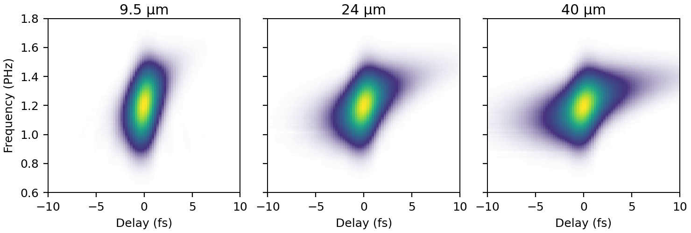

```@meta
CurrentModule = ModelPNPS
```

# ModelPNPS

**ModelPNPS** is a Julia package for forward modelling of PNPS (Parametrized
Nonlinear Process Spectrum) pulse-characterisation measurements. Given an input
pulse and an experimental geometry, it generates the trace a real apparatus
would record, by full spatially-resolved nonlinear propagation through the
measurement medium using [Luna.jl](https://github.com/LupoLab/Luna.jl).

The point is a faithful numerical experiment rather than a fast 1-D
approximation: the simulated trace contains the effects that the analytic
forward models inside retrieval algorithms neglect. Because the input pulse is
known exactly, such traces are ground truth for testing and developing
retrieval algorithms. ModelPNPS does the forward modelling only; the retrieval
half is its companion package, [Croak](https://github.com/LupoLab/croak), which
reads the scan files ModelPNPS writes and retrieves the pulse from them.



*Simulated TG-FROG traces of a 1 fs, 260 nm pulse after 9.5, 24 and 40 µm of
fused silica — the substrate-thickness series of the reference paper below.
The transient grating, the phase-matched four-wave-mixing signal, the
geometrical delay smearing and the chromatic aperture response all emerge from
the propagation; none is imposed.*

## The paper

ModelPNPS was built for, and is described in:

> J. C. Travers and C. Brahms, *Extreme ultrashort pulse retrieval with
> differentiable physical forward models* (in preparation, 2026).
> *(Placeholder — this reference will be updated on publication.)*

The paper uses ModelPNPS as a first-principles virtual TG-FROG instrument: a
transform-limited 1 fs pulse at 260 nm illuminates a four-hole boxcar mask, the
three transmitted beamlets are focused into a fused silica substrate, and the
tilted, spatially separated fields are propagated coherently with full
angular-spectrum dispersion, diffraction and the Kerr nonlinearity. The signal
is collected through an apertured window in the far field, delay by delay,
exactly as a spectrometer would record it. The paper specifies this instrument
in detail, bounds every approximation the simulation itself makes (at or below
the ``10^{-4}`` level, with the delayed Raman response treated separately), and
uses the resulting traces to validate retrieval models against the dispersion,
beam-geometry and collection physics of few-femtosecond deep-ultraviolet
measurements. The retrievals themselves are done with
[Croak](https://github.com/LupoLab/croak), which implements the paper's
differentiable forward models and solvers. If you use ModelPNPS in published
work, please cite the paper.

## Scope

The aim is a complete PNPS trace-modelling package — 3D numerical models of
the major pulse-characterisation experiments, built so that the simulated trace
reflects the real physics of the measurement:

- **Spatial effects** — finite beam size, mode shape, beam overlap and crossing
  geometry, diffraction, apertures and mask edges.
- **Phase-matching** — the wavelength- and angle-dependent efficiency of the
  nonlinear process across the interaction volume.
- **Dispersion** — material dispersion of the nonlinear medium and the
  associated pulse reshaping during propagation.
- **Walkoff** — spatial and temporal walkoff between the interacting beams.
- **Chromatic vignetting** — the wavelength-dependent spatial filtering of the
  signal beam by the collection optics.
- **Real nonlinear efficiency** — the true χ⁽ⁿ⁾ conversion, not an idealised
  instantaneous-thin-medium response.

These effects matter most where the analytic forward models break down:
broadband DUV/VUV pulses, thick media, strongly phase-mismatched geometries.

## Current status

The currently implemented process is **TG-FROG** (Transient-Grating FROG): a
degenerate four-wave-mixing measurement in a thin solid substrate, modelled with
two beam schemes (hollow-fibre HE₁₁ mode through a four-hole boxcar mask, or a
simplified Gaussian-beam baseline) and a choice of signal-extraction windows. A
**self-diffraction** beam layout is also available, as the input geometry for the
planned SD-FROG process. See [Trace Simulation](trace_simulation.md) for the full
description and worked examples, and the [PNPS Framework](pnps.md) page for the
broader taxonomy and roadmap.

Beyond the core forward model, the package can inject a measured or separately
simulated pulse in place of the analytic Gaussian
([Input Pulses](input_pulses.md)), add the delayed nuclear response
([Nonlinear Response](nonlinear_response.md)), and propagate a real
carrier-resolved field instead of an envelope
([Field-Resolved Mode](field_mode.md)) — the last of these being how the
envelope approximation itself gets tested at single-cycle durations.

!!! note "Runs on a GPU, and that is the fast way"
    A full delay scan at realistic grid sizes is hours of work per delay point
    on CPUs. On an NVIDIA GPU the whole propagation runs on the device: 42 s per
    delay point on an H200 against 1.9 h on two CPU cores, a factor of about
    160. See [Running on a GPU](gpu.md). The CPU path remains fully supported
    and is intended for a SLURM cluster, one task per delay.

    The unit tests stay laptop-fast either way, by exercising every primitive
    without the propagation step, plus one tiny end-to-end smoke run.

## Contents

```@contents
Pages = [
    "pnps.md",
    "trace_simulation.md",
    "input_pulses.md",
    "nonlinear_response.md",
    "field_mode.md",
    "gpu.md",
    "accuracy.md",
    "interface.md",
]
Depth = 2
```

## API Index

```@index
```
