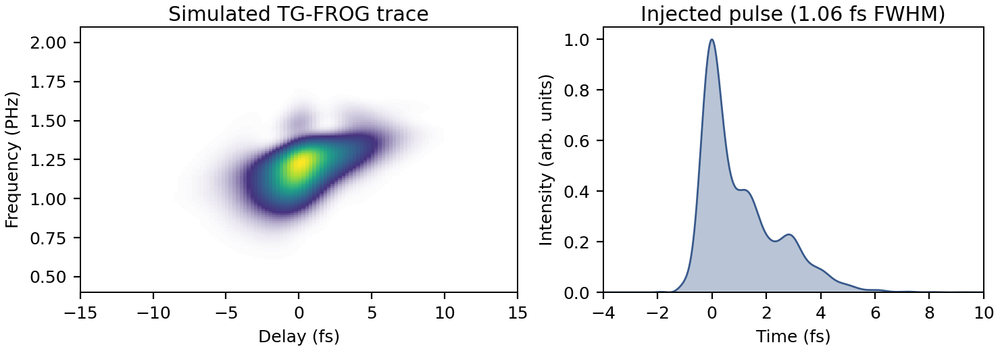

```@meta
CurrentModule = ModelPNPS
```

# Input Pulses

By default [`build_setup`](@ref) constructs its own input field: a transform-limited
Gaussian at `λ0` with intensity FWHM `τfwhm`, optionally chirped by the `GDD` and
`TOD` keywords. That is the right pulse for a controlled numerical experiment, where
the point is to retrieve a shape you specified exactly.

It is the wrong pulse when the question is whether a retrieval works on the light a
particular laser actually produces. A measured or separately simulated spectrum —
structured, with deep minima, satellites and a spectral phase no polynomial
reproduces — stresses a retrieval in ways an analytic Gaussian never does. The
`input_pulse` keyword injects one.

This page covers the whole path: getting the data in, conditioning it, injecting it,
and the two conventions that make the difference between a faithful injection and a
silently aliased one.

## The data container

[`InputPulseData`](@ref) holds a complex spectrum `Eω` on an **absolute, ascending,
approximately uniform** angular-frequency axis `ω` in rad/s. Absolute means the
physical frequency, not an offset from a carrier: the same convention Luna's
`grid.ω` uses, so no carrier bookkeeping is needed anywhere downstream.

Amplitude units are irrelevant. The beamlet builder rescales the assembled beam to
the `energy` you request, so a spectrum in arbitrary detector counts injects exactly
as well as one in V/m.

The constructor validates what it can: matching lengths, at least eight samples, and
an ascending axis. Everything else is checked at the point it matters.

```julia
using ModelPNPS

ω = collect(range(2π * 3e14, 2π * 2.1e15, 4096))     # rad/s, ascending
Eω = my_complex_spectrum(ω)                          # any complex amplitude scale
pulse = InputPulseData(ω, Eω)
```

## Loading from HDF5

[`load_input_pulse`](@ref) reads the two datasets from an HDF5 file. The spectrum
must be a native complex dataset — as written by HDF5.jl, or by `h5py` with a
compound `('r', 'i')` dtype.

```julia
pulse = load_input_pulse("DUV_opt.h5"; ω_key = "ω", Eω_key = "filteredEω")
```

The key names default to `"ω"` and `"Eω"`; pass them explicitly when the file uses
its own names, as above. A file whose entries are groups rather than datasets throws
an `ArgumentError` naming the offending key, rather than failing later with a type
error deep inside the interpolation.

## Conditioning: window, then centre

Two in-place steps normally sit between loading and injection, and the order matters.

### 1. Window out what the experiment would not deliver

[`spectral_window!`](@ref) applies a smooth tanh band-pass in place: unity well
inside `(λmin, λmax)`, rolling off with edge widths set as a fraction of the edge
angular frequency.

```julia
spectral_window!(pulse, 148e-9, 830e-9; wfrac_blue = 0.05, wfrac_red = 0.03)
```

This step is physical, not cosmetic. A DUV pulse produced by resonant
dispersive-wave emission in a hollow fibre arrives alongside a driver remnant that
can carry most of the energy — per-ω comparable to the UV peak even when a per-λ
plot makes it look negligible, and delayed by hundreds of femtoseconds. Injected
raw, it would dominate the χ⁽³⁾ interaction and you would be simulating a different
experiment. The window models the separation a real UV beamline provides.

!!! important "The windowed pulse is the ground truth"
    Whatever survives the window is the pulse the retrieval must be compared
    against, not the raw file. Keep the window parameters with the run's provenance —
    `extra_grid_metadata` is the place for them, and they then travel inside the
    output file:

    ```julia
    extra_grid_metadata = Dict{String, Any}(
        "source_file"   => basename(path),
        "window_nm"     => [148.0, 830.0],
        "window_wfrac"  => [0.05, 0.03],
    )
    ```

### 2. Centre the pulse on its own time origin

[`center_pulse!`](@ref) removes the linear component of the spectral phase, so the
temporal envelope peaks at the data FFT's natural origin. It returns the pulse and
the shift applied, in seconds (positive means the pulse arrived late and was
advanced).

```julia
pulse, tshift = center_pulse!(pulse)
```

A pure linear spectral phase is physically irrelevant — it is a choice of time
origin. Numerically it matters twice:

- It sets how much `trange` the simulation must hold. The window has to cover the
  pulse *and* the delay scan; a pulse sitting 500 fs off-origin wastes that span.
- More importantly, it decides whether the spectrum can be interpolated at all. A
  pulse far from its grid's time origin has a spectral phase rotating by up to π per
  sample, and no real/imaginary interpolation can resample that.
  [`interp_input_pulse`](@ref) measures the median per-sample phase rotation and
  warns when it exceeds 1 rad, naming `center_pulse!` as the fix.

`center_pulse!` requires an approximately uniform `ω` grid and throws an
`ArgumentError` otherwise. The returned shift is reported modulo the data grid's time
period, since the on-grid phase is identical for any branch.

## Injection

Pass the conditioned pulse to [`build_setup`](@ref):

```julia
beam   = HE11Beam(125e-6, 5.0, 0.1)
window = PhysicalMaskWindow(; holex = -0.75e-3, holey = -0.75e-3,
                              holediam = 1.0e-3, zmask = 0.1, apod = :tanh)

setup = build_setup(;
    λ0 = 260e-9, τfwhm = 1e-15, energy = 0.1e-6,
    thickness = 40e-6, material = :SiO2,
    mask_diam = 1.0e-3, mask_spacing = 1.0e-3,
    λlims = (140e-9, 950e-9), trange = 160e-15,
    beam, window,
    input_pulse = pulse,
)
```

What the other keywords mean once `input_pulse` is set:

| Keyword | Role with a data pulse |
|---|---|
| `λ0` | nominal only — mask apodisation defaults, diagnostics, metadata |
| `τfwhm` | nominal only — no longer describes the injected pulse |
| `energy` | still authoritative; the beam is rescaled to it |
| `GDD`, `TOD` | compose *on top of* the data phase; leave at zero unless deliberate |
| `λlims` | must bracket the data, including its tails — see below |

### HE₁₁ only, and why

`input_pulse` is supported for [`HE11Beam`](@ref) and throws an `ArgumentError` for
any other beam model. This is a real restriction, not an oversight. In the HE₁₁ path
the 1-D reference spectrum *is* the pulse: the chromatic mask vignetting is applied
to it downstream, so an arbitrary field composes through the geometry exactly. The
[`GaussianBeam`](@ref) builder instead constructs its own spatio-temporal Gaussian
from `(λ0, τfwhm)` and would silently ignore the data.

### Interpolation onto the simulation grid

[`interp_input_pulse`](@ref) resamples the data onto `grid.ω` with separate cubic
B-splines for the real and imaginary parts, zero outside the data's range. Two
diagnostics guard the two ways this goes wrong:

- **Too coarse.** If the data's `dω` is larger than the grid's, the interpolation is
  inventing spectral detail between samples, and a warning says so. The fix is denser
  data, not a coarser grid.
- **Off-origin.** The per-sample phase-rotation warning described above.

Finally the field is shifted to the middle sample of Luna's centred time grid,
matching Luna's own `Fields.DataField` convention, so the propagated beamlets and the
stored temporal diagnostics agree.

### Choosing `λlims` and `trange`

The grid must hold the pulse's tails, not just its core. A red tail clipped at the
window edge reappears at the z-saves as wrap-around. Size the window from where
the spectrum actually falls below the level you care about (say 10⁻³ of peak), not
from the nominal bandwidth, and give `trange` room for the centred pulse *plus*
the full delay scan.

## Worked sequence

The whole path, with the QA step that catches a bad injection before hours of
propagation:

```julia
using ModelPNPS
import FFTW
import Printf: @printf

pulse = load_input_pulse("DUV_opt.h5"; Eω_key = "filteredEω")
spectral_window!(pulse, 148e-9, 830e-9; wfrac_blue = 0.05, wfrac_red = 0.03)
pulse, tshift = center_pulse!(pulse)

# QA on the data's own grid: duration, and how much energy sits inside the
# temporal window the simulation will hold.
let n = nextpow(2, 4 * length(pulse.ω))
    buf = zeros(ComplexF64, n)
    buf[eachindex(pulse.ω)] .= pulse.Eω
    it = abs2.(FFTW.ifft(buf))
    dt = 2π / (n * (pulse.ω[2] - pulse.ω[1]))
    t = (0:(n - 1)) .* dt
    t = ifelse.(t .> n * dt / 2, t .- n * dt, t)
    fwhm = count(>=(0.5maximum(it)), it) * dt
    core = sum(it[abs.(t) .< 30e-15]) / sum(it)
    @printf("centred by %+.2f fs, FWHM %.3f fs, %.4f of energy within ±30 fs\n",
            tshift * 1e15, fwhm * 1e15, core)
end
```

If that last fraction is not very close to 1, `trange` is about to be too small, or
the window has left something in the file that does not belong in the simulation.

## Example: a single-cycle RDW pulse

The final validation of the reference paper (see [The paper](index.md#The-paper))
runs exactly the sequence above. The resonant-dispersive-wave emission of a
gas-filled hollow-capillary fibre source — a 1.06 fs pulse with a structured
spectrum and a train of trailing satellites — is simulated at the generation
stage, conditioned with `spectral_window!` (148–830 nm) and `center_pulse!`, and
injected into the virtual TG-FROG instrument with `input_pulse`, exactly as a
real measurement would receive it. The trace below was recorded at a 9.5 µm
fused silica substrate through a 2.0 mm collection hole; because the injected
field is known exactly, retrievals of this trace can be scored against the
truth.



*Left: the simulated TG-FROG trace of the RDW pulse at a 9.5 µm fused silica
substrate. Right: the temporal intensity of the injected pulse — a 1.06 fs main
peak with trailing satellites from the soliton dynamics of the source.*

## API

Full docstrings for [`InputPulseData`](@ref), [`load_input_pulse`](@ref),
[`spectral_window!`](@ref), [`center_pulse!`](@ref) and
[`interp_input_pulse`](@ref) are on the [API Reference](interface.md) page.
